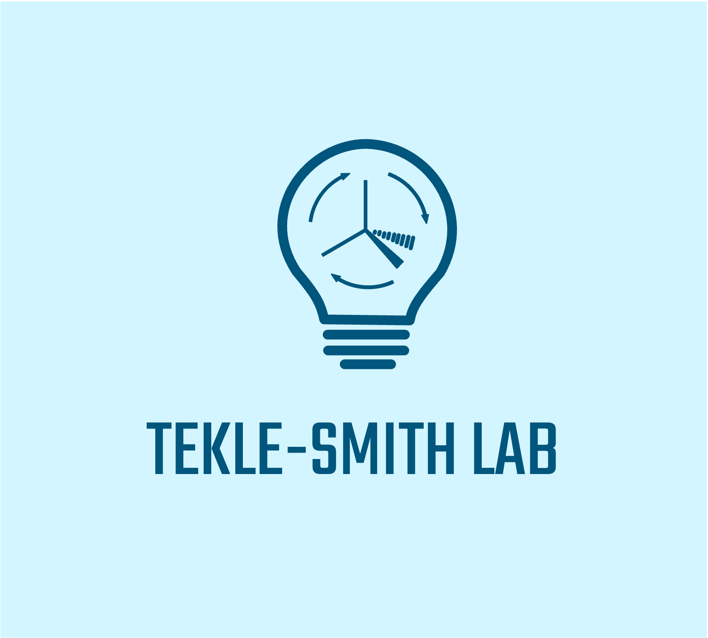

# Data-driven Approach to Understanding Tetrabutylammonium Decatungstate Catalyzed C(sp³)–H Functionalization Selectivity

A Python toolkit for automating and analyzing DFT-based calculations for the following:

- iteratively converting smiles to .xyz files on a remote server (convert_smiles_to_xyz_files.py)
- initial xtb optimization (submit_jobs.py)
- goat conformer search (submit_jobs.py)
- splitting conformers into all possible carbon centered radicals, if a C-H bond is present (generate_radicals.py)
- geometry optimization on closed-shell and open-shell species (submit_jobs.py)
- single point calculations for atomic charges, orbital energies, and philicities (submit_jobs.py)
- functions for iteratively reading output files and extracting relevant data to further automate analysis (read_out_files.py)
- source code for calculating buried volumes with DBSTEP (calculate_buried_volume.py)
- training and validation of a logistic regression model for functionalization prediction (logistic_regression_analysis.py)

for questions, contact Mimi Lavin (mkl2180@columbia.edu) 